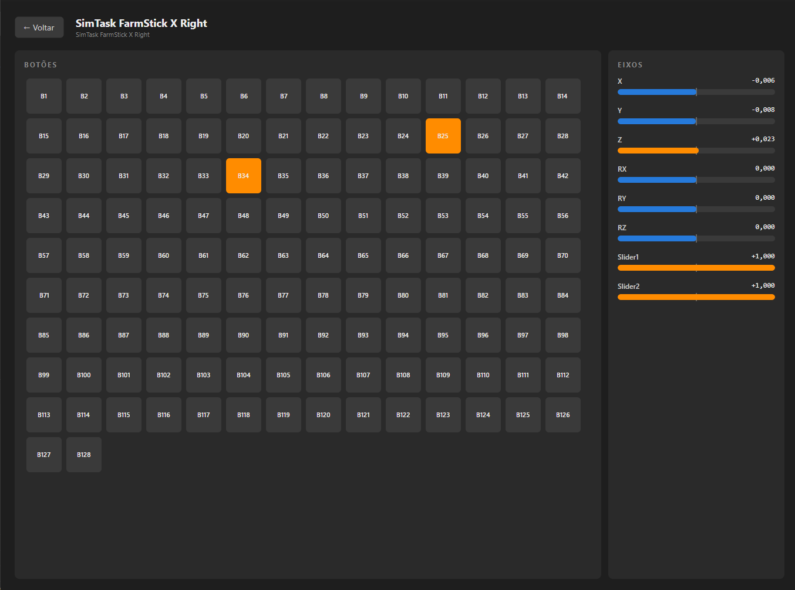

# Direct Input Tester

Direct Input Tester is a desktop app built with .NET and Avalonia to inspect and test DirectInput devices on Windows.

Its main purpose is to act as a practical **button and axis tester** for any DInput-compatible device, including:

- Joysticks
- Flight sticks
- Steering wheels
- Other DirectInput controllers

## What it does

- Detects connected DInput devices
- Lets you pick a device and open a live test view
- Shows real-time button states
- Shows real-time axis values and movement bars

## Why this project exists

I built this app to have a straightforward way to validate hardware inputs while testing controllers and peripherals.

## Contributions

I accept PRs with:

- New features
- Bug fixes

That said, for my current needs I consider the application functionally complete.

## AI Disclaimer

This project was vibe-coded using Github Copilot.
